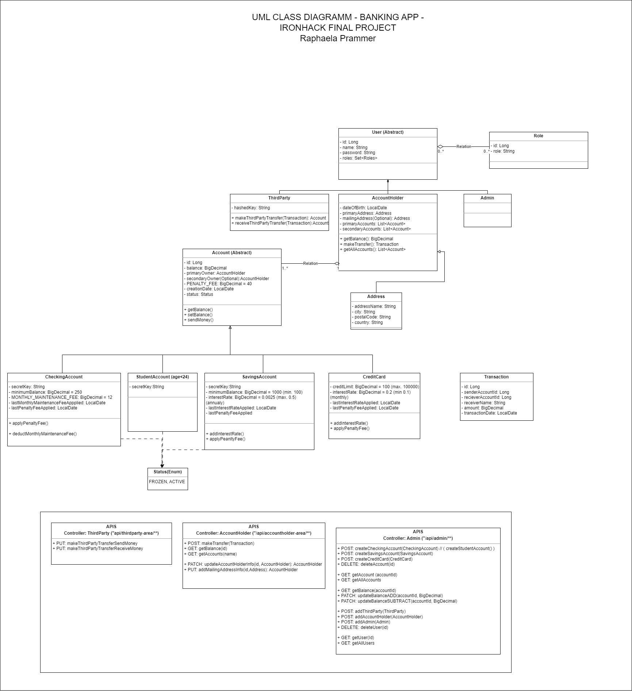
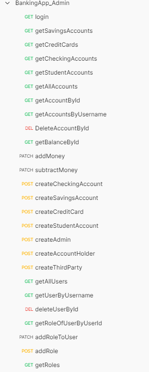
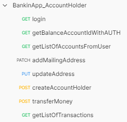
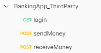

## Ironhack Final Project - BackEnd

# Banking System

This is the final project of the Ironhack Bootcamp for Back End, done by Raphaela Prammer [(Github)](https://github.com/RaphaelaPrammer). 

## Project Description

The goal of this project is to create a banking system app to manage banking data as money transfers, customer accounts. All data is being stored in relational database and the application runs on a local server. 
Within the application, we can:
- create Users (Account Holders, Third Party Users and Admins)
- create Accounts (Checking Account, Savings Account, Student Accounts, Credit Card)
- get Account information and its balance
- transfer money between accounts

The project also includes **Authentication and Authorization** via Spring Security.
All functionalities of the app are being tested with Test Units. 

## Stack used
- Java
- Spring Boot
- Maven
- MySQL
- Srping Security
- Postman

### Given Requirements for the Project:
#### Users
- Admin:
  - can create all types of accounts.
  - can create Users.
  - can create Third Party Users.
  - has access to all information of the users and their accounts and can modify any type of information, also can change the balance of the account. 
- Account Holder (User):
  - has access to all of his accounts
  - can modify certain information of his accounts (address information).
  - can create Users.
  - can access the balance of his accounts.
  - can transfer money between any of his accounts to any other account. 
- Third Party:
  - can send money away from an account holders account 
  - can receive money to an account holders account
  - for these operations, third party users have to provide their hashedKey in the header of the HTTP-Request, the account holders ID and his secret key. 

#### Accounts
- Student accounts:
  - can only be created when the age of the customer is below 24 years.
  - do not have any maintenance fee or penalty fee or interest rate.
- Checking accounts:
  - have a monthly maintenance Fee .
  - have a penalty fee when the balance drops below the minimum balance.
  - have an interest rate which is applied after one year. 
- Savings accounts:
  - have a penalty fee when the balance drops below the minimum balance.
  - have an interest rate which is applied after one year.
- Credit cards:
  - have a penalty fee when the balance drops below the minimum credit limit.
  - have an interest rate which is applied monthly.

All Accounts have pre-defined values for interest rate, minimum balance and credit limit, however, the admin can change those values within certain min/max values. 

### UML Class Diagram

### APIS
The routes for all the functionalities are divided by the type of User. Each user has an assigned Role ("ADMIN", "ACCOUNT-HOLDER" or "THIRD-PARTY"). Depending on the role, the user has different rights to access information. 

- Admin Routes:  

  

 [**Admin Routes Postman Collection JSON**](assets/BankingApp_Admin.postman_collection.json)

- Account Holder Routes:  

  

[**Account Holder Routes Postman Collection JSON**](BankinApp_AccountHolder.postman_collection.json)

- Third Party Routes:  
  

[**Third Party Routes Postman Collection JSON**](assets/BankingApp_ThirdParty.postman_collection.json)

### Notes for Mock Tests
Each test of the Controller Tests works individually. Do not run the all tests at once. 

